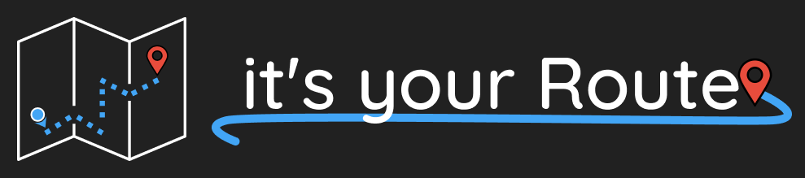

<h1 align="center">
    
</h1>

<h4 align="center"> 
	🚧 it's your Routes 🗺 em construção... 🚧
</h4>

<p align="center">
  

  
  
  <a href="https://github.com/tgmarinho/nlw1/commits/master">
    
  </a>

  

   <a href="https://github.com/AntDavi/it-s-yout-Route/stargazers">
	
   </a>

</p>

## 💻 Sobre o projeto

🗺 it's your Routes - é uma forma simples de criar uma rota entre dois pontos em um mapa.

O úsuario terá em suas mãos a melhor rota a se seguir em um mapa.

## 🚀 Como executar o projeto

```bash
# Clone este repositório
$ git clone https://github.com/AntDavi/it-s-yout-Route

# Instale as dependências
$ npm install

# Execute a aplicação
$ expo start
```

## 📝 Licença

Este projeto esta sobe a licença MIT.

Feito com ❤️ por Anthony Davi 👋🏽 [Entre em contato!](https://www.linkedin.com/in/antdavi/)

[nodejs]: https://nodejs.org/
[expo]: https://expo.io/
[rn]: https://facebook.github.io/react-native/
[yarn]: https://yarnpkg.com/
[vscode]: https://code.visualstudio.com/
[license]: https://opensource.org/licenses/MIT
